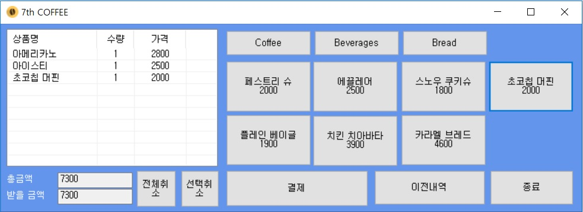
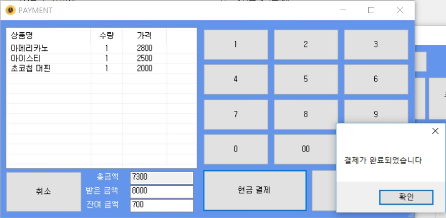
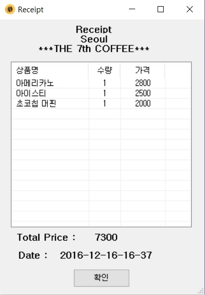
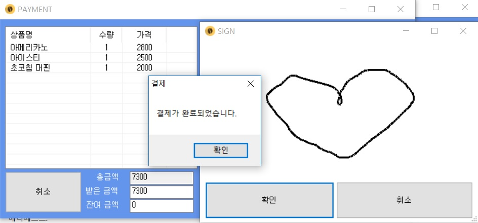
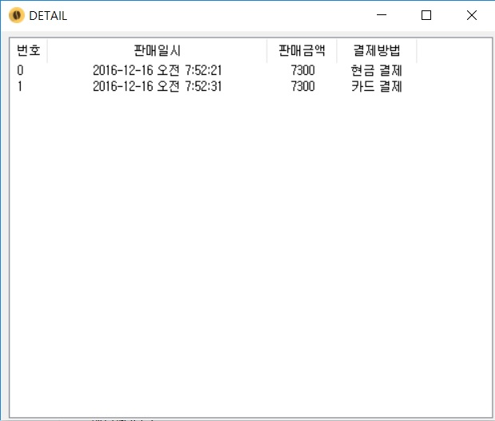

# Coffee POS Machine

## Project setup

- C# Window Forms Applications

## 프로젝트 내용

- Main에서 커피의 가격과 총 금액, 받을 금액, 결제, 이전 내역 등을 볼 수 있다.

- 결제창

- 영수증

- 사인창

- 이전 내역

## 프로젝트 기간

- 2016.09 ~ 2016.11 (2달)

## 사용언어

- C#

## IDE

- Visual Studio 2013
